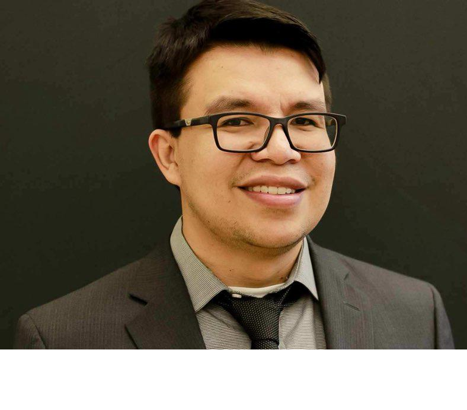

```{css, echo=FALSE}
.fluid.row.title{
  font-size: 3.9vw
}
h1{
  font-size:2.9vw;
  margin-top: 30px!important;
  margin-bottom: 15px!important;
  padding-top: 0px!important;
  padding-bottom: 0px!important;
  font-weight: bold;
  border-bottom: solid 1px black;
}

h2{
  margin-top: 30px!important;
  margin-bottom: 15px!important;
  padding-top: 0px!important;
  padding-bottom: 0px!important;
  font-size: 22px;
  font-weight: bold
}
p{
  display: block;
  margin-block-start: 1em;
  margin-block-end: 1em;
  margin-inline-start: 0px;
  margin-inline-end: 0px;
  
}
  

```


# Data Analyst


<div class = "row">
  
<div class = "col-lg-3">

<p align="center">
  Master in Science
  <br>
  Information Science
  <br>
  University of Arizona
  <br>
  <br>
</p>

</div>
  
  
<div class = "col-lg-9">
<br><br> 

<strong>About Me</strong>


Hi, I'm Armando Saavedra, a passionate Data Analyst with over five years of experience in turning raw data into actionable insights. Currently, I work as a Health Science Specialist (Data Analyst) at the Veterans Health Administration, where I leverage data to drive better healthcare outcomes.

<strong>Professional Background </strong>

My journey in data analysis began with a solid foundation in economics and statistics through my bachelor's degree in economics. I further honed my skills with hands-on experience in the agricultural sector, working at the Colombian Federation of Cattle Ranchers (FEDEGAN). There, I applied time series models such as ARIMA (Autoregressive Integrated Moving Average) and VAR (Vector Autoregression) to forecast male cattle premium prices.

After completing my master’s in Information Science, I worked as a data analyst at Pima Community College. This role deepened my expertise in extracting data from various sources using SQL, visualizing data through Power BI, and designing machine learning models—such as neural networks, random forests, and generalized linear models—to track and predict key academic performance indicators.

For the past two years, I have transitioned to the healthcare sector, where I have had the privilege of working on a wide range of projects. These include extracting medical data for research initiatives and developing statistical models to estimate survival curves and analyze drug interactions.


<strong>Skills and Expertise  </strong>

<ul>
    <li> <strong>Technical Skills:</strong> SQL, Python, R, Power BI,             Machine Learning, Data Visualization, Predictive Modeling, Statistical Analysis. </li>
    <li> <strong>Soft Skills:</strong> Problem-solving, Communication, Team                      Collaboration, Critical Thinking.</li>
    <li> <strong>Industry Expertise:</strong> Agricultural, Education,          Healthcare</li>
</ul>


<strong>Personal Background and Interests </strong>

Originally from Bogotá, Colombia, I moved to Arizona ten years ago, which resulted in a brief career pause. After the COVID pandemic, I relocated to North Carolina. Outside of work, I am passionate about continuous learning, whether it's through online courses on the latest data tools or staying up to date with advancements in healthcare analytics. I'm also an avid runner and love exploring new trails on the weekends.

<strong>Professional Philosophy </strong>

I believe that data is more than just numbers. it’s a powerful tool that, when used ethically and effectively, can solve real-world problems. I’m committed to staying at the forefront of the data analysis field, continuously updating my skills, and applying them to create meaningful change.


  

</div>

</div>


